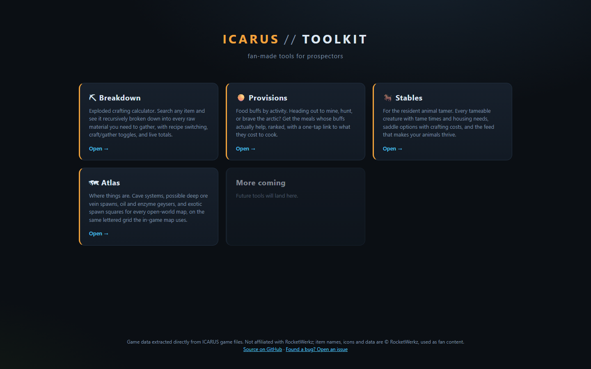
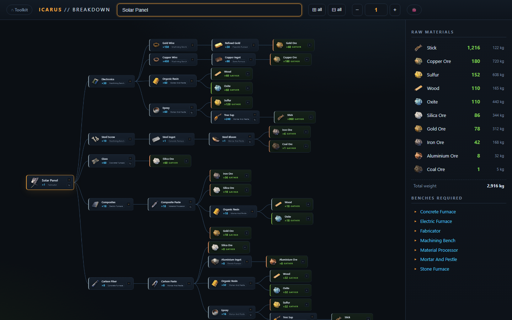
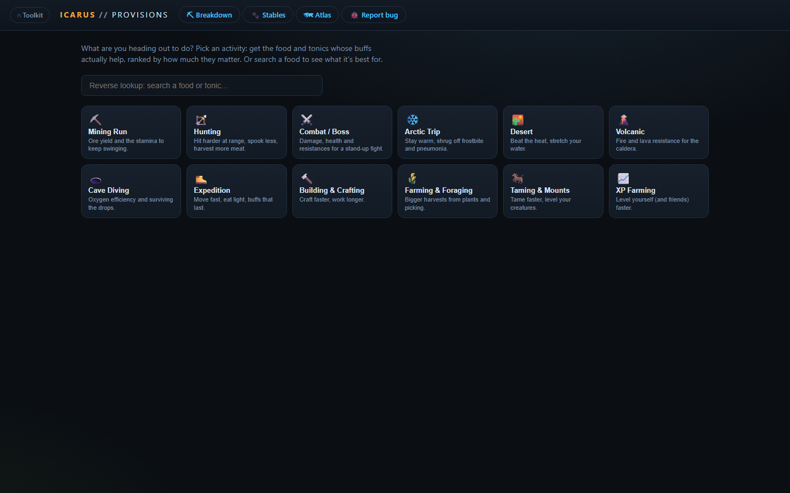
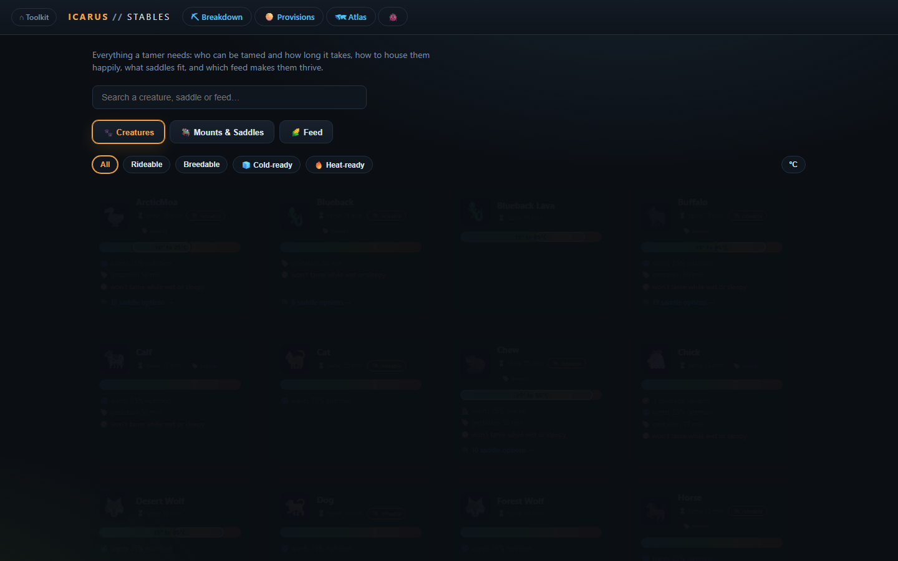
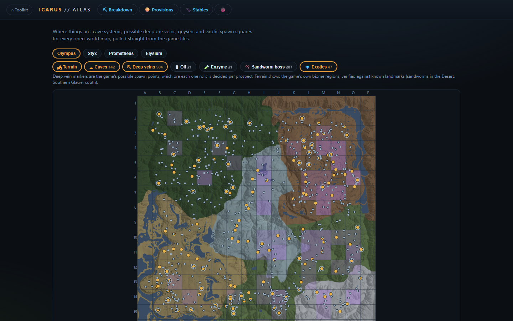

# Icarus Toolkit

Fan-made tools for [ICARUS](https://icarusgame.com), hosted at
**https://jampick.github.io/icarus-toolkit/**. Data comes **directly from the
game's files** - no wiki scraping.

[](https://jampick.github.io/icarus-toolkit/)

## Tools

### ⛏ Breakdown ([`/breakdown/`](https://jampick.github.io/icarus-toolkit/breakdown/))

Exploded crafting calculator - search any craftable item and see it recursively
broken down into every raw material you need to gather, with per-node control
over whether a component is crafted or gathered, alternate-recipe switching,
live raw-material totals, bench list, and pan/zoom.



### 🥧 Provisions ([`/provisions/`](https://jampick.github.io/icarus-toolkit/provisions/))

Food buffs by activity - pick what you're heading out to do (mining, hunting,
arctic, and more) and get the stomach-slot foods and slot-free tonics whose
buffs actually help, ranked with duration-damped scores. Includes reverse
lookup (search a food, see its best scenarios) and trip-length pack planning.



### 🐎 Stables ([`/stables/`](https://jampick.github.io/icarus-toolkit/stables/))

For the resident animal tamer - all tameable creatures with tame times,
temperature comfort ranges, shelter/nutrition needs and gestation timers;
saddle options per mount with crafting-cost links; and animal feed buffs.



### 🗺 Atlas ([`/atlas/`](https://jampick.github.io/icarus-toolkit/atlas/))

Where things are - cave systems, possible deep ore vein spawns, oil and enzyme
geysers, sandworm boss points and exotic spawn squares for every open-world
map (Olympus, Styx, Prometheus, Elysium), drawn over hillshaded relief
rendered from the game's landscape heightmaps, on the same lettered grid the
in-game map uses. Click a cave for its template contents: size, entrances,
deep veins inside, guaranteed exotic spawns, cave lakes and creature spawns
(caves with exotics get a highlight ring). Marker positions are extracted
from the terrain level files; deep vein markers are the game's possible
spawn points (which ore each rolls is decided per prospect). Grid
registration is verified against known landmarks (sandworms in the Desert,
Southern Glacier in the south).



Deploys automatically to GitHub Pages on push to `main`
(`.github/workflows/deploy.yml` runs the test pass, then `scripts/make_dist.py`).

## Layout

- `scripts/extract_pak.py` - pure-Python UE4 pak (v11/Zlib) extractor. Pulls the
  `D_*.json` data tables out of the game's `Data/data.pak` (~2 MB file, found in
  the game or dedicated-server install under `Icarus/Content/Data/`).
- `scripts/build_data.py` - compiles the extracted tables into
  `site/data/recipes.json` (items + recipes + output index, raw/gatherable
  flags, conversion-recipe detection, bench display names).
- `scripts/build_provisions_data.py` / `build_stables_data.py` /
  `build_atlas_data.py` - compile `provisions.json`, `stables.json` and
  `atlas.json` for the other tools.
- `tools/atlas-export/` - .NET 10 + CUE4Parse exporter that sweeps the terrain
  `.umap` files for placed markers (caves, deep vein spawns, geysers, worm
  points) into `data/atlas-raw/`. Only needed when refreshing after a game
  update; CI never runs it.
- `scripts/make_dist.py` - bundles everything into `dist/`: one self-contained
  `index.html` per tool (CSS + JS + data inlined) plus the shared `icons/`
  folder. Host `dist/` anywhere static (GitHub Pages, nginx, S3…).
- `site/` - the dev version (separate files; serve with
  `python3 -m http.server` from this folder).
- `data/game/` - extracted game JSON tables (checked in for reproducibility).
- `data/atlas-raw/` - raw marker exports per terrain (checked in; see
  `tools/atlas-export/README.md`).

## Refreshing after a game update

```bash
# 1. Get the new Data/data.pak from the game or dedicated server install
for f in D_ProcessorRecipes D_ItemTemplate D_ItemsStatic D_Itemable D_RecipeSets \
         D_Consumable D_ModifierStates D_Stats D_FoodTypes D_Tames D_Mounts \
         D_Saddles D_TamedCreatureModifiers D_ExoticSpawn D_Terrains; do
  python3 scripts/extract_pak.py /path/to/data.pak --extract "$f.json" -o data/game
done
# 2. Re-export map markers (needs .NET 10; see tools/atlas-export/README.md)
cd tools/atlas-export && dotnet run -c Release -- /path/to/Content/Paks ../../data/atlas-raw && cd ../..
# 3. Recompile
python3 scripts/build_data.py
python3 scripts/build_provisions_data.py
python3 scripts/build_stables_data.py
python3 scripts/build_atlas_data.py
# 4. Rebundle for hosting
python3 scripts/make_dist.py
```

## Tests

`bash scripts/run_tests.sh` runs the full pass:

- `scripts/test_pipeline.py` (Python, stdlib only) - runs every build script
  plus `make_dist.py`, then validates the generated `recipes.json` /
  `provisions.json` / `stables.json` / `atlas.json` (counts, key items,
  raw/craft flags, referential integrity, grid-cell validity, known
  regressions) and the `dist/` output (pages exist, inline JSON parses,
  landing links intact).
- `scripts/test_app.mjs` (Node, no deps) - syntax-checks all four apps,
  smoke-tests the recursive recipe tree (Solar Panel, cycle guard, positive
  integer totals), the provisions activity scoring (no NaN scores, every
  activity yields results, weight keys are real stat names), the stat
  display-value transforms, and the atlas grid-cell math.

CI runs the same script on every push and pull request
(`.github/workflows/deploy.yml`); the Pages deploy job only runs after the
test job passes, so a broken build never ships.

## Icons

Item icons (96 px PNGs in `site/icons/`) are game assets © RocketWerkz, used
here as fan content the same way the community wiki and other calculators do.
Icon set sourced from the community extraction in
[N30Z/icarus_calculator](https://github.com/N30Z/icarus_calculator); items
missing an icon fall back to a styled monogram.

## How the breakdown works

- A recipe tree is built from the item's recipe, recursing into each input.
- Crafts are ceiled per node (`ceil(needed / recipe output count)`), so counts
  are what you actually queue at a bench.
- Items tagged as ores / creature loot / world gatherables (Wood, Stone, Fiber,
  Oxite…) default to **GATHER** even when a conversion recipe exists (e.g.
  Frozen Wood → Wood); every node can be toggled between craft and gather, and
  multi-recipe items can cycle recipes (↻).
- The sidebar aggregates all current leaf nodes into gather totals plus total
  carry weight, and lists every bench the plan requires.

## How the atlas works

- `tools/atlas-export` mounts the game's pak files with CUE4Parse and sweeps
  every terrain `.umap` (persistent level + streaming tiles) for marker actor
  classes, recording world positions.
- All four terrains are 8x8 landscape tiles centered on the world origin, so
  `build_atlas_data.py` maps world coordinates onto the in-game 16x16 lettered
  grid with a fixed +-403200 bounds box.
- Exotic spawns are not placed actors; the game spawns them at runtime from
  `D_ExoticSpawn`, whose row names encode grid squares - the atlas shades
  those squares and counts spawns per square.
- The terrain background is rendered from the game's landscape heightmaps:
  `atlas-export --terrain` stitches every landscape component (4096 per map,
  an 8065x8065 vertex grid) into a global height array, applies a dual-light
  hillshade with hypsometric altitude tinting, detects water (rivers and
  lakes are carved perfectly flat into the heightmap) and tints it blue,
  then colors everything with a natural palette mapped from the
  `T_Terrain0XX_Biome` mask, writing one 4096px JPEG per map. Heights and
  markers share the same origin-centered bounds, so they register with no
  extra math; orientation was confirmed by checking that sandworm markers
  land on the Desert region and the Southern Glacier sits in the south.
- Cave contents come from the `Prefabs/Cave/CAVE_*` template assets each
  placed cave references: entrance count, deep vein and exotic spawn counts,
  lakes, and the creature spawn map, parsed once per template and joined to
  markers at build time.
